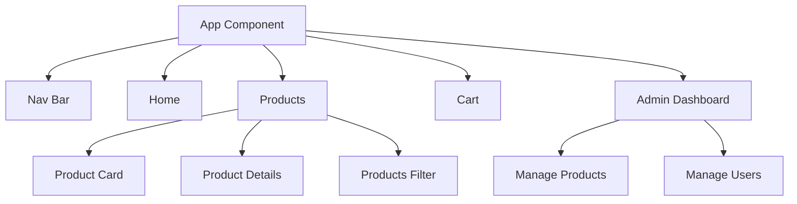

# E-Commerce Frontend Application

An E-commerce web application built with [Angular CLI](https://github.com/angular/angular-cli) version 19.2.9, offering a shopping experience with robust user management and administration capabilities. This modern single-page application follows Angular best practices and implements a clean, modular architecture.

## Table of Contents

- [Project Overview](#project-overview)
- [Functional Overview](#functional-overview)
- [Technical Architecture](#technical-architecture)
- [Core Components and Modules](#core-components-and-modules)
- [Services and State Management](#services-and-state-management)
- [Routing and Navigation](#routing-and-navigation)
- [UI and Styling](#ui-and-styling)
- [Core Interfaces](#core-interfaces)
- [Configuration and Environment](#configuration-and-environment)
- [Project Structure](#project-structure)
- [Running and Building the App](#running-and-building-the-app)
- [Security](#security)
- [Potential Improvements](#potential-improvements)

## Project Overview

### Purpose

This e-commerce platform provides a comprehensive online shopping experience with the following core capabilities:

- Product browsing and filtering by categories
- Real-time shopping cart management
- Secure user authentication and authorization
- Admin dashboard for product and user management
- Responsive design for all devices
- Theme customization (light/dark mode)

### Tech Stack

- **Frontend Framework**: Angular 19.2.0
- **State Management**: RxJS 7.8.0
- **Authentication**: JWT-based authentication
- **Styling**: CSS with responsive design
- **HTTP Communication**: Angular HttpClient with interceptors
- **Form Handling**: Angular Reactive Forms
- **Route Protection**: Custom route guards
- **API Integration**: RESTful API communication

## Functional Overview

### Key Features

- User Authentication (Login/Registration)
- Product Browsing and Filtering
- Shopping Cart Management
- Secure Checkout Process
- User Profile Management
- Administrative Dashboard
  - Product Management
  - User Management

### User Roles

- **Guest Users**: Browse products
- **Authenticated Users**: Purchase products, manage cart, update profile
- **Administrators**: Manage products and users

## Technical Architecture

### Component Structure



## Core Components and Modules

### Key Components

1. **Authentication Components** (`/src/app/components/auth/`)

   - `LoginComponent`: User authentication
   - `RegistrationComponent`: New user registration
   - `ChangePasswordComponent`: Password management

2. **Shopping Components** (`/src/app/components/ProductsPage/`)

   - `ProductsComponent`: Main product listing
   - `ProductDetailsComponent`: Detailed product view
   - `ProductCardComponent`: Reusable product display
   - `ProductsFilterComponent`: Category-based filtering
   - `CartComponent`: Shopping cart management
   - `CheckoutComponent`: Order processing

3. **Admin Components** (`/src/app/components/admin/`)

   - `ManageProductsComponent`: Product CRUD operations
   - `ManageUsersComponent`: User management interface

4. **Common Components**
   - `HeaderComponent`: Application header
   - `NavBarComponent`: Navigation menu
   - `FooterComponent`: Application footer
   - `ProfileComponent`: User profile management

### Core Interfaces (`/src/app/Core/interface/`)

- `IAppUser`: User model definition
- `IAppRole`: User role specifications
- `IProduct`: Product model
- `ICategory`: Product category model
- `ICart`: Shopping cart model
- `ICartItem`: Cart item model
- `IFilterOptions`: Product filtering options

## Services and State Management

### Core Services

- `AuthService`: Handles user authentication and authorization
- `ProductService`: Manages product data and operations
- `CartService`: Handles shopping cart functionality
- `UserService`: Manages user data and operations
- `JwtService`: Handles JWT token management
- `ThemeService`: Manages application theming

### State Management

- Local component state for UI-specific data
- Service-based state management for shared data
- JWT-based authentication state

## Routing and Navigation

### Main Routes

- `/`: Home page
- `/products`: Product listing
- `/products/:id`: Product details
- `/cart`: Shopping cart
- `/checkout`: Checkout process
- `/profile`: User profile
- `/admin/*`: Admin routes (protected)

### Route Guards

- `AuthGuard`: Protects authenticated routes
- `AdminGuard`: Protects admin routes
- `AuthenticatedGuard`: Prevents authenticated users from accessing auth pages

## UI and Styling

- Angular Material components for consistent UI
- Responsive design for all screen sizes
- Custom CSS for specific styling needs
- Theme support (light/dark mode)

## Configuration and Environment

### Environment Files

- `environment.ts`: Development configuration
  - API URL: `http://localhost:8080`
  - Other environment-specific settings

## Running and Building the App

### Development Setup

1. Clone the repository
2. Install dependencies:
   ```bash
   npm install
   ```
3. Start development server:
   ```bash
   npm start
   ```
   or
   ```bash
   ng serve
   ```
   Application will be available at `http://localhost:4200`

## Potential Improvements

1. **Technical Enhancements**

   - Implement NgRx for state management
   - Add E2E testing with Cypress
   - Implement PWA capabilities

2. **Feature Enhancements**

   - Advanced product search
   - Order tracking system
   - User reviews and ratings
   - Wishlist functionality
   - Social media integration

3. **Performance Optimizations**
   - Implement lazy loading for all feature modules
   - Add image optimization
   - Implement caching strategies
   - Add service worker support

---
