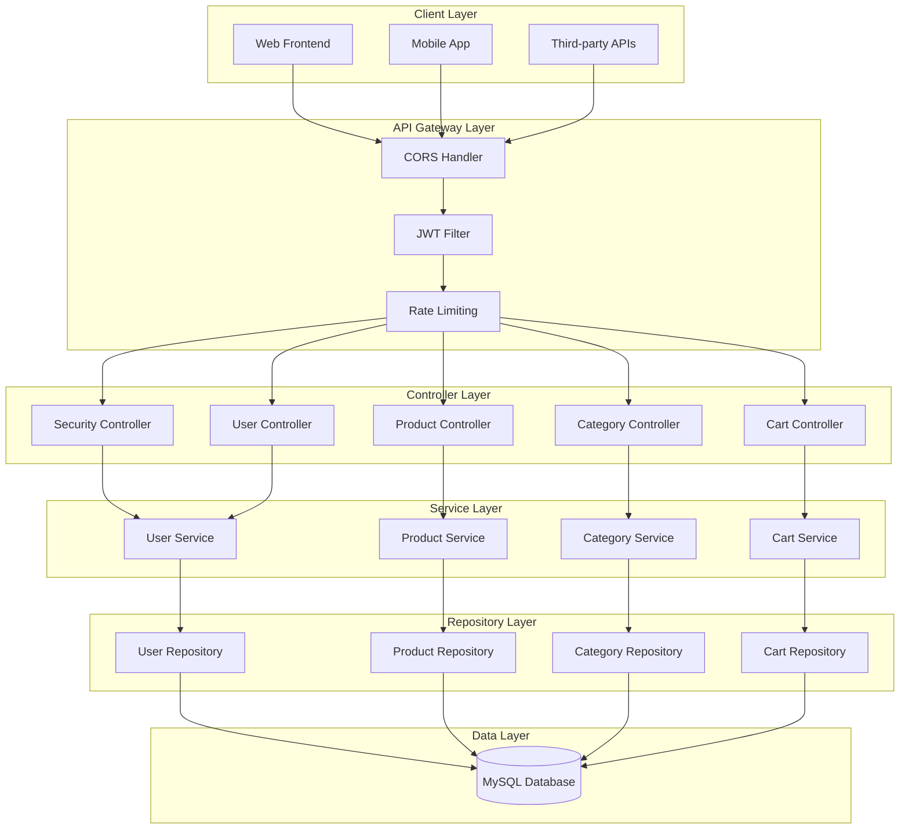
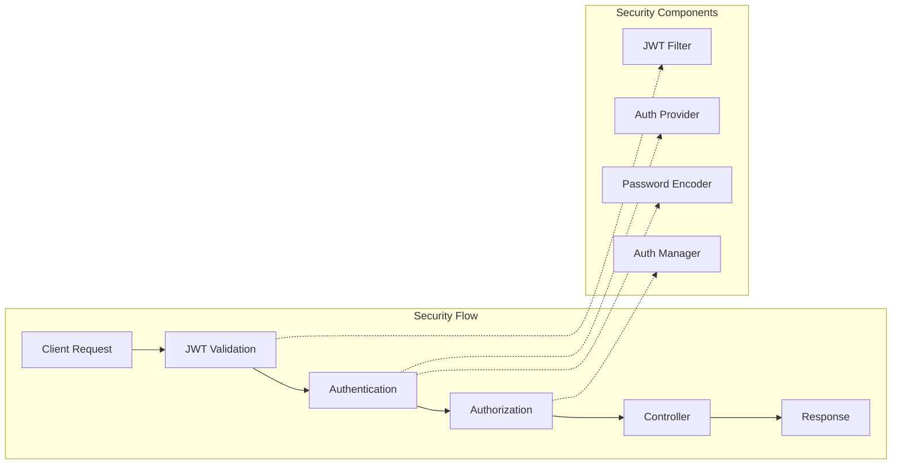
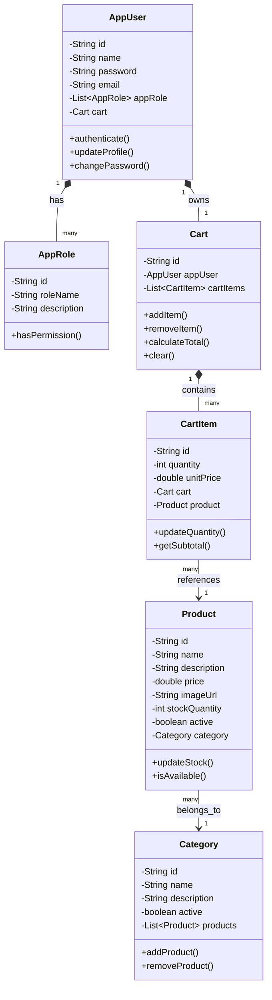
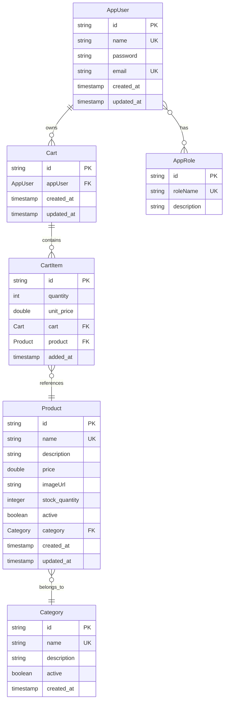
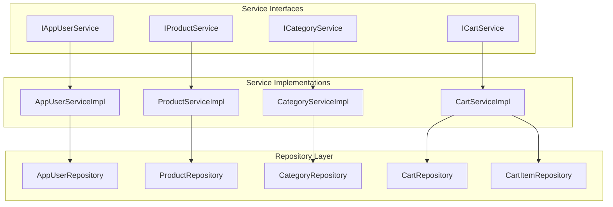
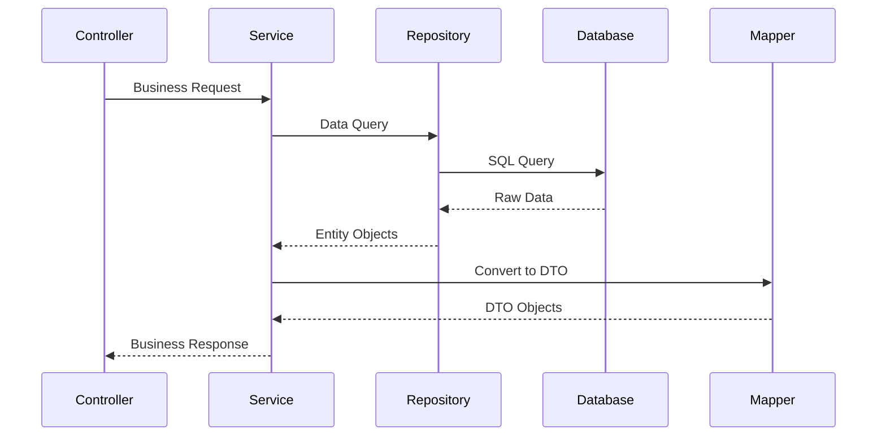
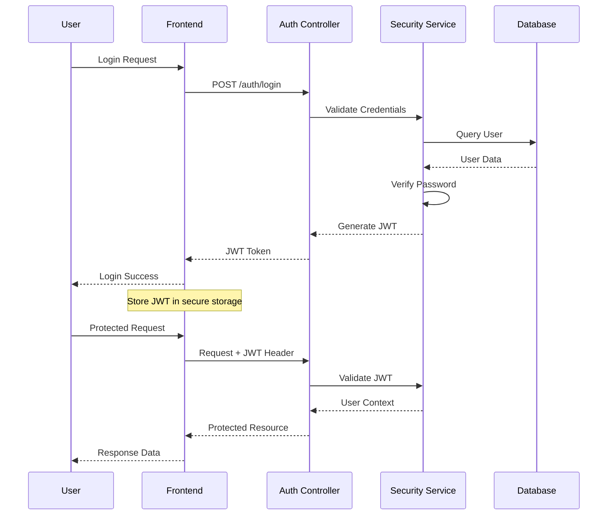
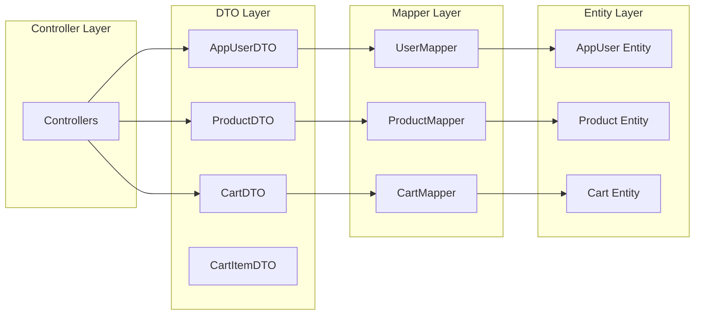

# E-Commerce Backend Application

# BackEnd Report

---

## Executive Summary

This report presents a comprehensive analysis of a Spring Boot-based e-commerce backend application designed to support online retail operations. The application implements industry-standard practices for user management, product catalog organization, shopping cart functionality, and secure authentication mechanisms.

---

## 1. Project Overview

### 1.1 Business Objectives

The e-commerce backend application addresses critical business requirements for modern online retail:

- **User Experience**: Seamless user registration, authentication, and profile management
- **Product Management**: Comprehensive catalog system with categorization and inventory control
- **Shopping Experience**: Intuitive cart management with real-time updates
- **Security**: Enterprise-grade authentication and authorization mechanisms
- **Scalability**: Modular architecture supporting future expansion

### 1.2 Core Features

The application delivers essential e-commerce functionality through well-defined modules:

- **Authentication & Authorization**: JWT-based security with role differentiation (USER/ADMIN)
- **User Management**: Complete user lifecycle management with secure password handling
- **Product Catalog**: Dynamic product management with category-based organization
- **Shopping Cart**: Real-time cart operations with persistent state management
- **Administrative Functions**: Comprehensive admin tools for system management

### 1.3 Technology Stack

The application leverages modern Java ecosystem technologies:

| Component     | Technology            | Version |
| ------------- | --------------------- | ------- |
| Framework     | Spring Boot           | 3.4.4   |
| Language      | Java                  | 21      |
| Database      | MySQL                 | Latest  |
| Security      | Spring Security + JWT | Latest  |
| Documentation | SpringDoc OpenAPI     | Latest  |
| Build System  | Maven                 | Latest  |

---

## 2. System Architecture

### 2.1 Architectural Overview

The application follows a layered architecture pattern promoting separation of concerns and maintainability:



### 2.2 Security Architecture

The security implementation ensures comprehensive protection across all system layers:



---

## 3. Data Model Design

### 3.1 Models Class Diagram



### 3.2 Entity Relationship Diagram

The database schema implements normalized design principles with clear entity relationships:



---

## 4. Service Layer Architecture

### 4.1 Service Interface Design

The service layer implements clean interface abstractions for business logic:



### 4.2 Business Logic Flow



---

## 5. API Design & Documentation

### 5.1 RESTful API Structure

The API follows RESTful principles with clear resource organization:

| Endpoint Category | Base Path   | Purpose                                     |
| ----------------- | ----------- | ------------------------------------------- |
| Authentication    | `/auth`     | User authentication and token management    |
| User Management   | `/appUser`  | User CRUD operations and profile management |
| Product Catalog   | `/product`  | Product information and catalog operations  |
| Categories        | `/category` | Product categorization management           |
| Shopping Cart     | `/cart`     | Cart operations and item management         |

### 5.2 API Endpoint Documentation

#### Authentication Endpoints

```
POST /auth/login
  Description: Authenticate user and generate JWT token
  Request Body: { "name": "string", "password": "string" }
  Response: { "token": "jwt_token", "user": "user_details" }

GET /auth/profile
  Description: Get authenticated user profile
  Headers: Authorization: Bearer {token}
  Response: { "user": "user_profile" }
```

#### User Management Endpoints

```
POST /appUser/addAppUser
  Description: Register new user account
  Request Body: { "name": "string", "email": "string", "password": "string" }
  Response: { "user": "created_user" }

PUT /appUser/changePassword
  Description: Change user password
  Request Body: { "oldPassword": "string", "newPassword": "string" }
  Response: { "message": "success" }

GET /appUser/managed [ADMIN]
  Description: Get all users (admin only)
  Response: [{ "users": "user_list" }]
```

#### Product Catalog Endpoints

```
GET /product
  Description: Get all products with pagination
  Query Parameters: page, size, sort
  Response: { "products": "product_list", "pagination": "info" }

POST /product/addProduct [ADMIN]
  Description: Add new product
  Request Body: { "name": "string", "description": "string", "price": "number", "categoryId": "string" }
  Response: { "product": "created_product" }
```

#### Swagger Documentation


### 5.3 API Response Standards

All API responses follow a consistent structure:

```json
{
  "success": true,
  "message": "Operation completed successfully",
  "data": {
    /* response data */
  },
  "timestamp": "2024-01-01T00:00:00Z",
  "errors": null
}
```

---

## 6. Security Implementation

### 6.1 Authentication Flow



### 6.2 Authorization Matrix

| Role      | User Management   | Product Management | Category Management | Cart Operations |
| --------- | ----------------- | ------------------ | ------------------- | --------------- |
| ADMIN     | Full Access       | Full Access        | Full Access         | Full Access     |
| USER      | Own Profile Only  | Read Only          | Read Only           | Own Cart Only   |
| Anonymous | Registration Only | Read Only          | Read Only           | None            |

### 6.3 Security Features

**Password Security**

- BCrypt encryption with salt
- Minimum complexity requirements
- Secure password change workflow

**JWT Implementation**

- Stateless authentication
- 10-minute token expiration
- Secure token validation
- Role-based claims

**API Security**

- CORS configuration
- Request validation
- SQL injection prevention
- XSS protection

---

## 7. Data Transfer Objects (DTOs)

### 7.1 DTO Architecture



### 7.2 DTO Specifications

**AppUserDTO Structure**

```java
public class AppUserDTO {
    private String id;
    private String name;
    private String email;
    private List<String> roles;
    private LocalDateTime createdAt;
}
```

**ProductDTO Structure**

```java
public class ProductDTO {
    private String id;
    private String name;
    private String description;
    private BigDecimal price;
    private String imageUrl;
    private String categoryName;
    private Integer stockQuantity;
    private Boolean available;
}
```

**CartDTO Structure**

```java
public class CartDTO {
    private String id;
    private String appUserId;
    private List<CartItemDTO> items;
    private BigDecimal totalPrice;
    private Integer itemCount;
    private LocalDateTime lastUpdated;
}
```

---

## 8. Configuration Management

### 8.1 Application Configuration

```properties
# Application Identity
spring.application.name=Application

# Database Configuration
spring.datasource.url=jdbc:mysql://localhost:3306/web_project_db?createDatabaseIfNotExist=true
spring.datasource.username=${DB_USERNAME:root}
spring.datasource.password=${DB_PASSWORD:}
spring.datasource.driver-class-name=com.mysql.cj.jdbc.Driver

# JPA Configuration
spring.jpa.hibernate.ddl-auto=update
spring.jpa.show-sql=${SHOW_SQL:false}
spring.jpa.properties.hibernate.dialect=org.hibernate.dialect.MySQL8Dialect
spring.jpa.properties.hibernate.format_sql=true

# Security Configuration
jwt.secret=${JWT_SECRET:mySecretKey}
```

### 8.2 Security Configuration Details

```java
@Configuration
@EnableWebSecurity
public class SecurityConfig {

    @Bean
    public SecurityFilterChain filterChain(HttpSecurity http) throws Exception {
        return http
            .csrf(csrf -> csrf.disable())
            .sessionManagement(session -> session.sessionCreationPolicy(STATELESS))
            .authorizeHttpRequests(auth -> auth
                .requestMatchers("/auth/**", "/appUser/addAppUser").permitAll()
                .requestMatchers("/product/**", "/category/**").permitAll()
                .requestMatchers(HttpMethod.GET, "/appUser/**").hasRole("ADMIN")
                .requestMatchers(HttpMethod.POST, "/product/**").hasRole("ADMIN")
                .anyRequest().authenticated()
            )
            .oauth2ResourceServer(oauth2 -> oauth2.jwt(Customizer.withDefaults()))
            .build();
    }
}
```

---

## 9. Future Enhancements

**Enhanced Security**

- Refresh token implementation
- OAuth2 social login integration
- Password reset functionality
- Multi-factor authentication

**Feature Enhancements**

- Order management system
- Advanced product search and filtering
- Product reviews and ratings
- Inventory management

**Business Features**

- Payment gateway integration
- Advanced analytics and reporting
- AI-powered recommendation engine
- Multi-language support

---

## 10. Conclusion

The e-commerce backend application represents a scalable solution built on modern Java technologies. The implementation demonstrates best practices in security, data modeling, and API design while providing a solid foundation for future enhancements.

---

---

# FrontEnd Report
