# Complete E-Commerce Application Report

## Full-Stack Web Application Documentation

---

## Executive Summary

This report presents a comprehensive analysis of a modern full-stack e-commerce application built with Angular 19 on the frontend and Spring Boot 3.4.4 on the backend. The application implements industry-standard practices for user management, product catalog organization, shopping cart functionality, and secure authentication mechanisms across both client and server layers.

The system delivers a complete online retail solution, security, and scalable architecture designed to support modern e-commerce operations. The application combines Angular's powerful frontend capabilities with Spring Boot's robust backend services to create a cohesive platform for online retail.

---

## 1. Project Overview

### 1.1 Business Objectives

The full-stack e-commerce application addresses critical business requirements for modern online retail operations through integrated frontend and backend solutions:

**User Experience Excellence**: The Angular frontend provides user registration, authentication, and profile management with responsive design and intuitive navigation. The Spring Boot backend ensures reliable data processing and secure API endpoints to support these user interactions.

**Comprehensive Product Management**: The system implements a dynamic product catalog with category-based organization and inventory control. The frontend delivers engaging product browsing experiences while the backend maintains data integrity and business logic enforcement.

**Shopping Experience Optimization**: Real-time shopping cart functionality spans both frontend and backend, providing users with immediate feedback and persistent state management across sessions.

**Enterprise Security**: JWT-based authentication and authorization mechanisms protect both client-side routes and server-side endpoints, ensuring comprehensive security coverage throughout the application stack.

**Scalable Architecture**: Both frontend and backend implement modular designs supporting future expansion and feature enhancement without architectural constraints.

### 1.2 Complete Feature Set

The integrated application delivers comprehensive e-commerce functionality through coordinated frontend and backend components:

**Frontend Capabilities**:

- User Authentication with secure login and registration interfaces
- Dynamic Product Browsing with category-based filtering and search
- Real-time Shopping Cart Management with immediate updates
- Responsive Design supporting all device types
- Theme Customization with light and dark mode options
- Administrative Dashboard for system management

**Backend Services**:

- JWT-based Security with role differentiation (USER/ADMIN)
- Complete User Lifecycle Management with secure password handling
- Dynamic Product Catalog Management with category organization
- Persistent Shopping Cart Operations with real-time state synchronization
- RESTful API Architecture with comprehensive endpoint coverage

### 1.3 Technology Stack Overview

The application leverages modern technologies across both frontend and backend layers:

| Layer        | Component        | Technology             | Version |
| ------------ | ---------------- | ---------------------- | ------- |
| **Frontend** | Framework        | Angular CLI            | 19.2.9  |
|              | Language         | TypeScript             | Latest  |
|              | State Management | RxJS                   | 7.8.0   |
|              | Styling          | CSS + Angular Material | Latest  |
| **Backend**  | Framework        | Spring Boot            | 3.4.4   |
|              | Language         | Java                   | 21      |
|              | Database         | MySQL                  | Latest  |
|              | Security         | Spring Security + JWT  | Latest  |
|              | Documentation    | SpringDoc OpenAPI      | Latest  |

---

## 2. System Architecture

### 2.1 Full-Stack Architecture Overview

The application implements a comprehensive three-tier architecture spanning frontend presentation, backend services, and data persistence layers:

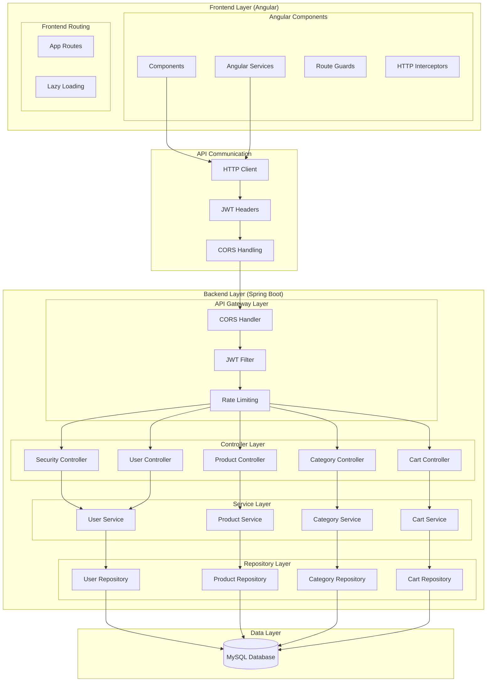

### 2.2 Frontend Component Architecture

The Angular frontend implements a hierarchical component structure with clear separation of concerns:

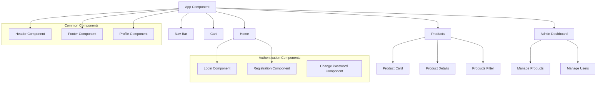

### 2.3 Integrated Security Architecture

The security implementation ensures comprehensive protection across both frontend and backend layers:

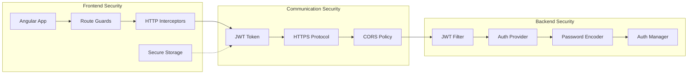

---

## 3. Frontend Architecture Deep Dive

### 3.1 Angular Application Structure

The frontend implements Angular best practices with a modular architecture supporting maintainability and scalability. The application structure follows Angular's recommended patterns with clear separation between feature modules, shared components, and core services.

### 3.2 Core Components and Modules

**Authentication Components** located in `/src/app/components/auth/` provide comprehensive user authentication functionality:

The `LoginComponent` handles user authentication with form validation and error handling. The `RegistrationComponent` manages new user registration with client-side validation before backend submission. The `ChangePasswordComponent` provides secure password management with confirmation validation.

**Shopping Components** in `/src/app/components/ProductsPage/` deliver the core e-commerce experience:

The `ProductsComponent` serves as the main product listing interface with pagination and filtering capabilities. The `ProductDetailsComponent` provides detailed product information with purchase options. The `ProductCardComponent` offers reusable product display functionality across different contexts. The `ProductsFilterComponent` enables category-based filtering with real-time updates. The `CartComponent` manages shopping cart operations with real-time calculation updates. The `CheckoutComponent` handles the order processing workflow.

**Admin Components** in `/src/app/components/admin/` provide administrative functionality:

The `ManageProductsComponent` delivers comprehensive product CRUD operations with form validation and image handling. The `ManageUsersComponent` provides user management interfaces with role assignment capabilities.

**Common Components** ensure consistent user experience:

The `HeaderComponent` maintains application branding and navigation. The `NavBarComponent` provides responsive navigation with authentication-aware menu options. The `FooterComponent` displays application information and links. The `ProfileComponent` enables user profile management with secure update functionality.

### 3.3 Services and State Management

The Angular application implements service-based architecture for data management and business logic:

**AuthService** manages user authentication and authorization with JWT token handling, automatic token refresh, and role-based access control. The service maintains authentication state across application sessions and provides methods for login, logout, and profile management.

**ProductService** handles all product-related operations including product retrieval, filtering, and search functionality. The service implements caching strategies for improved performance and manages product state across components.

**CartService** provides comprehensive shopping cart functionality with real-time updates, persistent storage, and calculation services. The service maintains cart state across user sessions and synchronizes with backend services.

**UserService** manages user data operations including profile updates, password changes, and user management functions for administrative users.

**JwtService** handles JWT token management with automatic renewal, secure storage, and token validation. The service ensures secure communication with backend APIs.

**ThemeService** manages application theming with light and dark mode support, user preference persistence, and dynamic theme switching.

### 3.4 Routing and Navigation

The Angular application implements comprehensive routing with protection mechanisms:

**Main Routes** provide clear navigation structure:

- Root path `/` directs to the home page with featured products and promotional content
- `/products` displays the main product listing with filtering and pagination
- `/products/:id` shows detailed product information with purchase options
- `/cart` provides shopping cart management and checkout initiation
- `/checkout` handles the complete checkout process
- `/profile` enables user profile management and settings
- `/admin/*` provides administrative routes with role-based protection

**Route Guards** ensure proper access control:

The `AuthGuard` protects routes requiring authentication by verifying JWT token validity and redirecting unauthenticated users to login. The `AdminGuard` restricts access to administrative routes by checking user roles and permissions. The `AuthenticatedGuard` prevents authenticated users from accessing authentication pages, improving user experience by avoiding unnecessary navigation.

### 3.5 UI and Styling Implementation

The frontend implements modern, responsive design principles with comprehensive styling solutions:

**Angular Material Integration** provides consistent UI components with Material Design principles, ensuring familiar user interactions and professional appearance across all application interfaces.

**Responsive Design** ensures optimal user experience across all device types through flexible layouts, breakpoint management, and touch-friendly interfaces for mobile users.

**Custom CSS Styling** addresses specific design requirements not covered by Angular Material, maintaining design consistency while providing unique visual elements.

**Theme Support** enables user preference customization with light and dark mode options, dynamic theme switching, and persistent user preferences across sessions.

---

## 4. Backend Architecture Deep Dive

### 4.1 Spring Boot Service Architecture

The backend implements a layered architecture pattern promoting separation of concerns and maintainability through well-defined service interfaces and implementations.

### 4.2 Data Model Design

**Models Class Diagram** illustrates the comprehensive entity relationships:

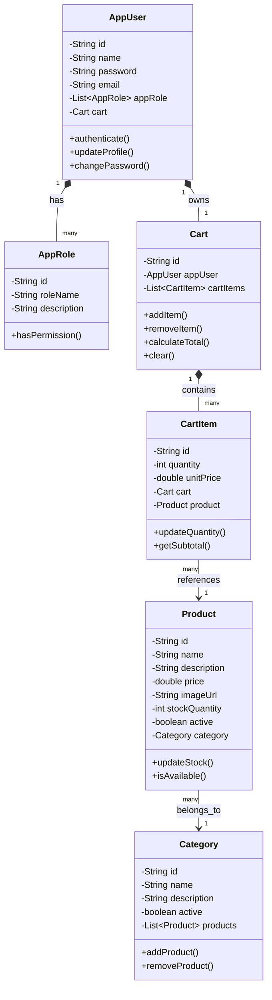

### 4.3 Entity Relationship Diagram

The database schema implements normalized design principles with clear entity relationships:

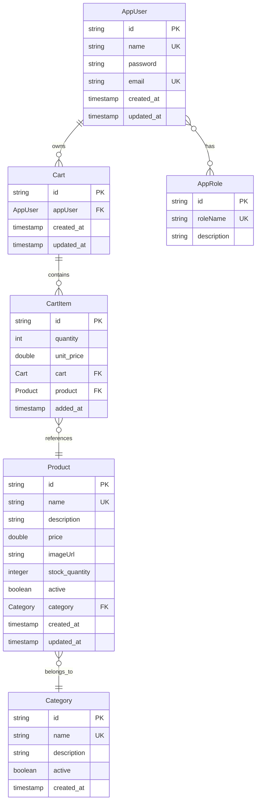

### 4.4 Service Layer Architecture

**Service Interface Design** implements clean abstractions for business logic:

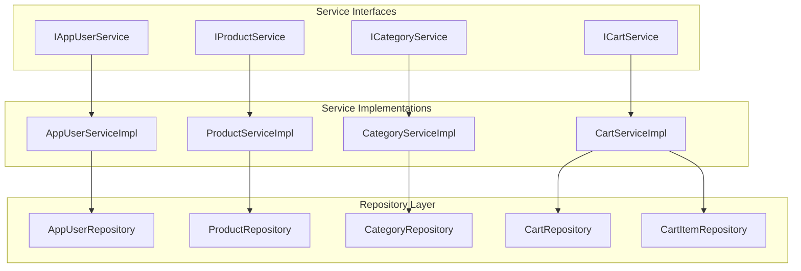

**Business Logic Flow** demonstrates the request processing pattern:

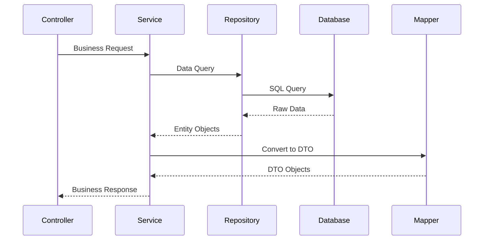

---

## 5. Full-Stack Integration

### 5.1 Frontend-Backend Communication

The application implements seamless communication between Angular frontend and Spring Boot backend through RESTful API integration with comprehensive error handling and state synchronization.

### 5.2 Authentication Flow Integration

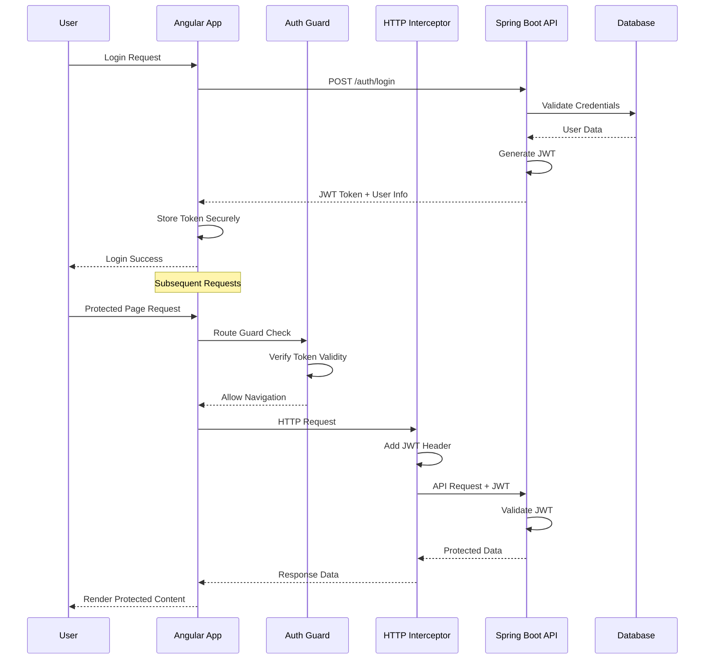

### 5.3 Real-Time Cart Synchronization

The shopping cart functionality demonstrates sophisticated frontend-backend integration with real-time updates, persistent state management, and conflict resolution. The Angular frontend maintains local cart state for immediate user feedback while synchronizing with Spring Boot backend services for data persistence and consistency across user sessions.

### 5.4 Core Interfaces Integration

The application maintains consistent data models across frontend and backend through shared interface definitions:

**Frontend Interfaces** in `/src/app/Core/interface/` define TypeScript models corresponding to backend entities:

`IAppUser` interface defines user model structure matching backend AppUser entity with properties for identification, authentication, and profile management.

`IAppRole` interface specifies user role definitions with permission mappings corresponding to backend authorization mechanisms.

`IProduct` interface models product data structure with complete property definitions matching backend Product entity specifications.

`ICategory` interface defines product categorization structure supporting frontend filtering and backend organization systems.

`ICart` and `ICartItem` interfaces model shopping cart functionality with complete integration between frontend state management and backend persistence services.

`IFilterOptions` interface defines product filtering capabilities supporting both frontend UI controls and backend query parameters.

---

## 6. API Design & Documentation

### 6.1 RESTful API Structure

The API implements comprehensive RESTful principles with clear resource organization supporting all frontend functionality:

| Endpoint Category | Base Path   | Purpose                                     | Frontend Integration |
| ----------------- | ----------- | ------------------------------------------- | -------------------- |
| Authentication    | `/auth`     | User authentication and token management    | AuthService          |
| User Management   | `/appUser`  | User CRUD operations and profile management | UserService          |
| Product Catalog   | `/product`  | Product information and catalog operations  | ProductService       |
| Categories        | `/category` | Product categorization management           | ProductService       |
| Shopping Cart     | `/cart`     | Cart operations and item management         | CartService          |

### 6.2 API Endpoint Documentation

**Authentication Endpoints** provide comprehensive user authentication:

```
POST /auth/login
  Description: Authenticate user and generate JWT token
  Request Body: { "name": "string", "password": "string" }
  Response: { "token": "jwt_token", "user": "user_details" }
  Frontend Integration: LoginComponent -> AuthService

GET /auth/profile
  Description: Get authenticated user profile
  Headers: Authorization: Bearer {token}
  Response: { "user": "user_profile" }
  Frontend Integration: ProfileComponent -> AuthService
```

**User Management Endpoints** support complete user lifecycle:

```
POST /appUser/addAppUser
  Description: Register new user account
  Request Body: { "name": "string", "email": "string", "password": "string" }
  Response: { "user": "created_user" }
  Frontend Integration: RegistrationComponent -> UserService

PUT /appUser/changePassword
  Description: Change user password
  Request Body: { "oldPassword": "string", "newPassword": "string" }
  Response: { "message": "success" }
  Frontend Integration: ChangePasswordComponent -> UserService

GET /appUser/managed [ADMIN]
  Description: Get all users (admin only)
  Response: [{ "users": "user_list" }]
  Frontend Integration: ManageUsersComponent -> UserService
```

**Product Catalog Endpoints** enable comprehensive product management:

```
GET /product
  Description: Get all products with pagination
  Query Parameters: page, size, sort
  Response: { "products": "product_list", "pagination": "info" }
  Frontend Integration: ProductsComponent -> ProductService

POST /product/addProduct [ADMIN]
  Description: Add new product
  Request Body: { "name": "string", "description": "string", "price": "number", "categoryId": "string" }
  Response: { "product": "created_product" }
  Frontend Integration: ManageProductsComponent -> ProductService
```

### 6.3 Swagger Documentation

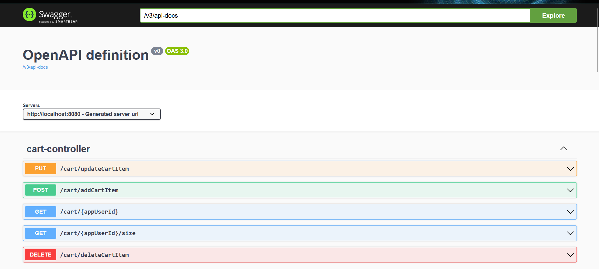

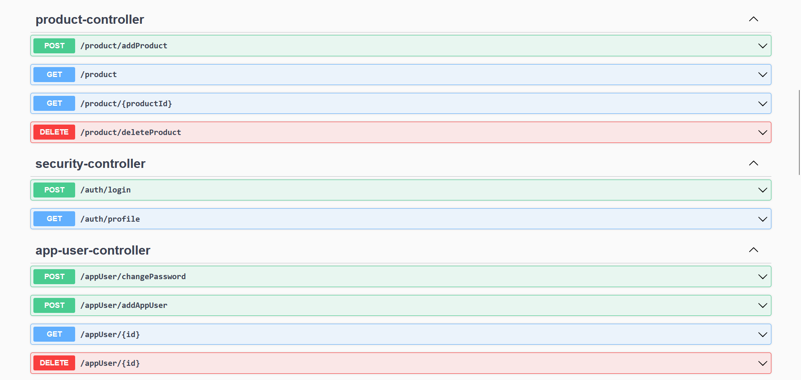

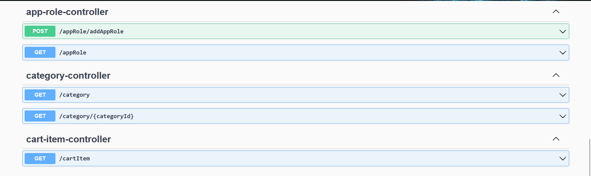

### 6.4 API Response Standards

All API responses follow consistent structure supporting frontend error handling and state management:

```json
{
  "success": true,
  "message": "Operation completed successfully",
  "data": {
    /* response data */
  },
  "timestamp": "2024-01-01T00:00:00Z",
  "errors": null
}
```

---

## 7. Security Implementation

### 7.1 Comprehensive Security Architecture

The application implements multi-layered security across both frontend and backend components with JWT-based authentication, role-based authorization, and comprehensive protection mechanisms.

### 7.2 Frontend Security Implementation

**Route Protection** ensures secure navigation through Angular guards that verify user authentication status and role permissions before allowing access to protected routes.

**HTTP Interceptors** automatically attach JWT tokens to API requests, handle token expiration, and manage authentication errors with automatic redirect functionality.

**Secure Storage** implements best practices for token storage with automatic cleanup and secure handling of sensitive user data.

**Form Validation** provides client-side validation for all user inputs with comprehensive error handling and security-focused validation rules.

### 7.3 Backend Security Implementation

**Authentication Flow** provides secure user verification:

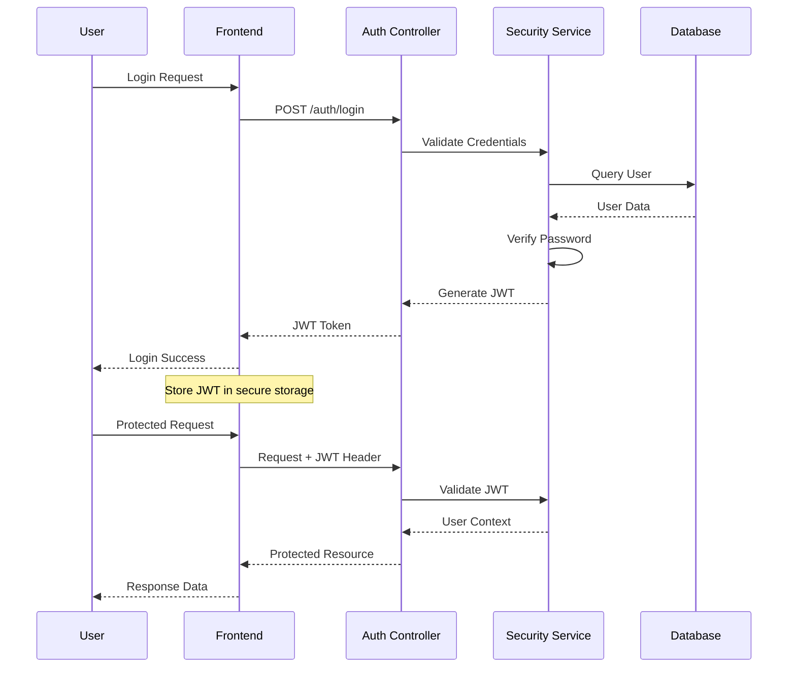

### 7.4 Authorization Matrix

The application implements comprehensive role-based access control:

| Role      | User Management   | Product Management | Category Management | Cart Operations | Frontend Access |
| --------- | ----------------- | ------------------ | ------------------- | --------------- | --------------- |
| ADMIN     | Full Access       | Full Access        | Full Access         | Full Access     | All Routes      |
| USER      | Own Profile Only  | Read Only          | Read Only           | Own Cart Only   | User Routes     |
| Anonymous | Registration Only | Read Only          | Read Only           | None            | Public Routes   |

### 7.5 Security Features

**Password Security** implements comprehensive protection with BCrypt encryption using salt, minimum complexity requirements enforced on both frontend and backend, and secure password change workflow with validation.

**JWT Implementation** provides stateless authentication with 10-minute token expiration, secure token validation across all requests, and role-based claims for authorization decisions.

**API Security** includes CORS configuration for cross-origin requests, comprehensive request validation on all endpoints, SQL injection prevention through parameterized queries, and XSS protection through input sanitization.

**Frontend Security** implements secure routing with guard protection, automatic token refresh handling, secure storage practices for sensitive data, and comprehensive error handling for security-related issues.

---

## 8. Data Transfer Objects (DTOs)

### 8.1 DTO Architecture Integration

The application maintains consistent data transfer between frontend and backend through comprehensive DTO implementation:

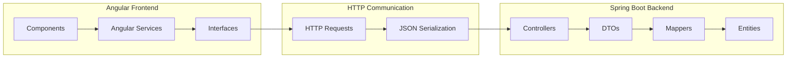

### 8.2 DTO Specifications

**AppUserDTO Structure** provides comprehensive user data transfer:

```java
public class AppUserDTO {
    private String id;
    private String name;
    private String email;
    private List<String> roles;
    private LocalDateTime createdAt;
}
```

This structure corresponds directly to the frontend `IAppUser` interface ensuring consistent data handling across the application stack.

**ProductDTO Structure** enables complete product information transfer:

```java
public class ProductDTO {
    private String id;
    private String name;
    private String description;
    private BigDecimal price;
    private String imageUrl;
    private String categoryName;
    private Integer stockQuantity;
    private Boolean available;
}
```

The ProductDTO aligns with frontend `IProduct` interface supporting all product display and management functionality.

**CartDTO Structure** facilitates comprehensive cart management:

```java
public class CartDTO {
    private String id;
    private String appUserId;
    private List<CartItemDTO> items;
    private BigDecimal totalPrice;
    private Integer itemCount;
    private LocalDateTime lastUpdated;
}
```

This structure supports the frontend `ICart` interface enabling real-time cart synchronization and management.

---

## 9. Configuration Management

### 9.1 Backend Application Configuration

The Spring Boot backend implements comprehensive configuration management:

```properties
# Application Identity
spring.application.name=Application

# Database Configuration
spring.datasource.url=jdbc:mysql://localhost:3306/web_project_db?createDatabaseIfNotExist=true
spring.datasource.username=${DB_USERNAME:root}
spring.datasource.password=${DB_PASSWORD:}
spring.datasource.driver-class-name=com.mysql.cj.jdbc.Driver

# JPA Configuration
spring.jpa.hibernate.ddl-auto=update
spring.jpa.show-sql=${SHOW_SQL:false}
spring.jpa.properties.hibernate.dialect=org.hibernate.dialect.MySQL8Dialect
spring.jpa.properties.hibernate.format_sql=true

# Security Configuration
jwt.secret=${JWT_SECRET:mySecretKey}
```

### 9.2 Frontend Environment Configuration

The Angular application implements environment-specific configuration:

**Environment Files** provide development and production settings:

- `environment.ts` contains development configuration with API URL set to `http://localhost:8080` and development-specific feature flags
- Production environment configuration supports deployment-specific settings and optimizations

### 9.3 Security Configuration Integration

```java
@Configuration
@EnableWebSecurity
public class SecurityConfig {

    @Bean
    public SecurityFilterChain filterChain(HttpSecurity http) throws Exception {
        return http
            .csrf(csrf -> csrf.disable())
            .sessionManagement(session -> session.sessionCreationPolicy(STATELESS))
            .authorizeHttpRequests(auth -> auth
                .requestMatchers("/auth/**", "/appUser/addAppUser").permitAll()
                .requestMatchers("/product/**", "/category/**").permitAll()
                .requestMatchers(HttpMethod.GET, "/appUser/**").hasRole("ADMIN")
                .requestMatchers(HttpMethod.POST, "/product/**").hasRole("ADMIN")
                .anyRequest().authenticated()
            )
            .oauth2ResourceServer(oauth2 -> oauth2.jwt(Customizer.withDefaults()))
            .build();
    }
}
```

This configuration aligns with frontend route protection ensuring consistent security enforcement across the application.

---

## 10. Future Enhancements

### 10.1 Technical Enhancements

**Frontend Improvements** include NgRx implementation for advanced state management providing better scalability and debugging capabilities. End-to-end testing with Cypress would ensure comprehensive application testing across user workflows. Progressive Web Application capabilities would enhance user experience with offline functionality and native app-like features.

**Backend Enhancements** focus on enhanced security with refresh token implementation providing better session management, OAuth2 social login integration expanding authentication options, password reset functionality improving user experience, and multi-factor authentication adding security layers.

### 10.2 Feature Enhancements

**User Experience Features** include advanced product search with filtering and sorting capabilities, comprehensive order tracking system providing real-time status updates, user review and rating system enabling community feedback, wishlist functionality supporting user preferences, and social media integration expanding user engagement.

**Business Features** encompass payment gateway integration supporting multiple payment methods, advanced analytics and reporting providing business insights, AI-powered recommendation engine enhancing user experience, multi-language support expanding market reach, and inventory management system supporting business operations.

### 10.3 Performance Optimizations

**Frontend Optimizations** include lazy loading implementation for all feature modules reducing initial bundle size, image optimization supporting faster page loads, comprehensive caching strategies improving application performance, and service worker support enabling offline functionality.

**Backend Optimizations** focus on database query optimization improving response times, caching implementation reducing database load, API rate limiting protecting against abuse, and monitoring integration providing operational insights.

### 10.4 Scalability Enhancements

The application architecture supports horizontal scaling through microservices decomposition, load balancing implementation, database sharding strategies, and cloud-native deployment patterns. The modular design enables incremental enhancement without architectural constraints.

---

## 11. Conclusion

This comprehensive full-stack e-commerce application represents a modern, scalable solution built on industry-standard technologies and best practices. The Angular frontend delivers user experience with responsive design, intuitive navigation, and comprehensive functionality. The Spring Boot backend provides robust API services with enterprise-grade security, efficient data management, and scalable architecture.
