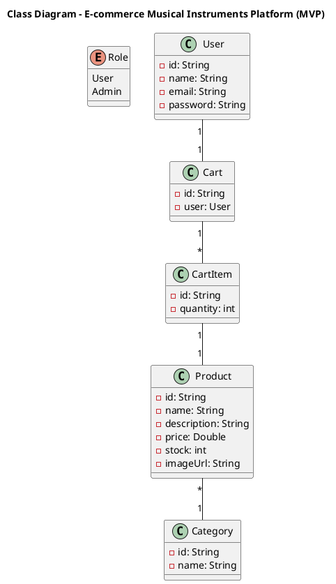

```plantuml
@startuml
title Class Diagram - E-commerce Musical Instruments Platform (MVP)

enum Role {
    User
    Admin
}

class User {
  - id: String
  - name: String
  - email: String
  - password: String
}

class Product {
  - id: String
  - name: String
  - description: String
  - price: Double
  - stock: int
  - imageUrl: String
}

class Category {
  - id: String
  - name: String
}

class Cart {
  - id: String
  - user: User
}

class CartItem {
  - id: String
  - quantity: int
}

' Relationships
User "1" -- "1" Cart
Product "*" -- "1" Category
Cart "1" -- "*" CartItem
CartItem "1" -- "1" Product

@enduml
```
