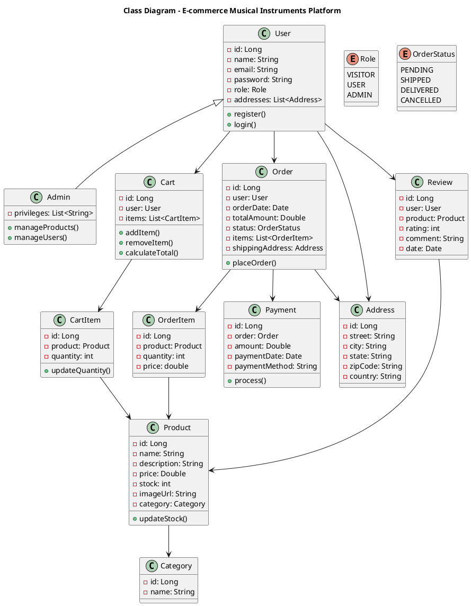

```plantuml
@startuml
title Class Diagram - E-commerce Musical Instruments Platform

class User {
  - id: Long
  - name: String
  - email: String
  - password: String
  - role: Role
  - addresses: List<Address>
  + register()
  + login()
}

enum Role {
  VISITOR
  USER
  ADMIN
}

class Admin {
  - privileges: List<String>
  + manageProducts()
  + manageUsers()
}

class Product {
  - id: Long
  - name: String
  - description: String
  - price: Double
  - stock: int
  - imageUrl: String
  - category: Category
  + updateStock()
}

class Category {
  - id: Long
  - name: String
}

class Cart {
  - id: Long
  - user: User
  - items: List<CartItem>
  + addItem()
  + removeItem()
  + calculateTotal()
}

class CartItem {
  - id: Long
  - product: Product
  - quantity: int
  + updateQuantity()
}

class Order {
  - id: Long
  - user: User
  - orderDate: Date
  - totalAmount: Double
  - status: OrderStatus
  - items: List<OrderItem>
  - shippingAddress: Address
  + placeOrder()
}

enum OrderStatus {
  PENDING
  SHIPPED
  DELIVERED
  CANCELLED
}

class OrderItem {
  - id: Long
  - product: Product
  - quantity: int
  - price: double
}

class Address {
  - id: Long
  - street: String
  - city: String
  - state: String
  - zipCode: String
  - country: String
}

class Payment {
  - id: Long
  - order: Order
  - amount: Double
  - paymentDate: Date
  - paymentMethod: String
  + process()
}

class Review {
  - id: Long
  - user: User
  - product: Product
  - rating: int
  - comment: String
  - date: Date
}

' Relationships
User --> Cart
User --> Order
User --> Review
User --> Address
User <|-- Admin

Product --> Category
Cart --> CartItem
CartItem --> Product
Order --> OrderItem
OrderItem --> Product
Order --> Address
Order --> Payment
Review --> Product

@enduml

```
