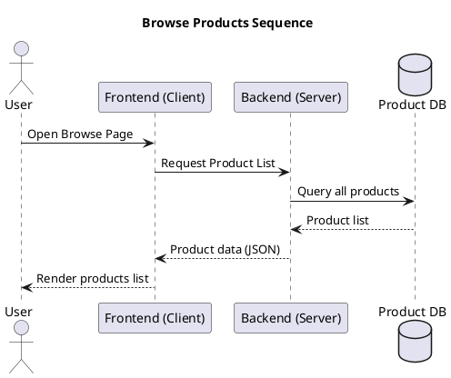

```plantuml
@startuml
title Browse Products Sequence

actor User as Client
participant "Frontend (Client)" as Frontend
participant "Backend (Server)" as Backend
database "Product DB" as DB

Client -> Frontend: Open Browse Page
Frontend -> Backend: Request Product List
Backend -> DB: Query all products
DB --> Backend: Product list
Backend --> Frontend: Product data (JSON)
Frontend --> Client: Render products list

@enduml
```
