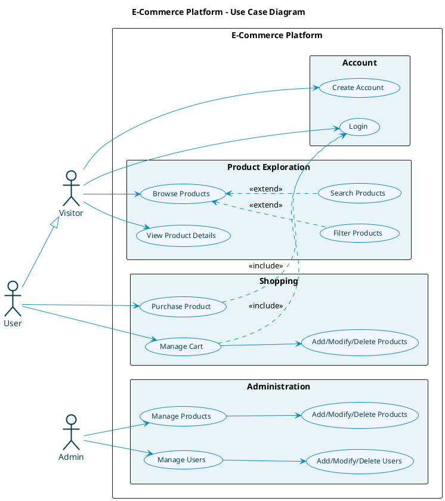

```plantuml
@startuml E-Commerce Platform Use Cases
' Overall styling improvements
skinparam shadowing false
skinparam handwritten false
skinparam defaultFontName Arial
skinparam DefaultTextAlignment center
skinparam packageStyle rectangle
skinparam backgroundColor white

' Actor styling
skinparam actor {
  BackgroundColor white
  BorderColor #073B4C
  FontColor #073B4C
  BorderThickness 2
}

' Use case styling
skinparam usecase {
  BackgroundColor #EFF6FF
  BorderColor #118AB2
  FontColor #073B4C
  BorderThickness 1
  ArrowColor #118AB2
  Shadowing false
  FontSize 12
}

' Arrow styling
' skinparam ArrowColor #118AB2
' skinparam ArrowThickness 1.5

' Layout control
left to right direction

' Actor definitions with custom styling
:Visitor: as visitor #EFF6FF
:User: as user #EFF6FF
:Admin: as admin #EFF6FF

' Package with title
rectangle "E-Commerce Platform" as platform #FFFFFF {
  ' Group related use cases with packages
  package "Product Exploration" #E8F4F8 {
    usecase "Browse Products" as UC1
    usecase "Search Products" as UC2
    usecase "Filter Products" as UC3
    usecase "View Product Details" as UC4
  }

  package "Account" #E8F4F8 {
    usecase "Create Account" as UC5
    usecase "Login" as UC6
  }

  package "Shopping" #E8F4F8 {
    usecase "Purchase Product" as UC7
    usecase "Manage Cart" as UC12
    usecase "Add/Modify/Delete Products" as UC13
  }

  package "Administration" #E8F4F8 {
    usecase "Manage Products" as UC8
    usecase "Add/Modify/Delete Products" as UC9
    usecase "Manage Users" as UC10
    usecase "Add/Modify/Delete Users" as UC11
  }
}

' Relationships with better labeling
visitor --> UC1
visitor --> UC4
visitor --> UC5
visitor --> UC6

UC1 <.. UC2 : <<extend>>
UC1 <.. UC3 : <<extend>>

' User inherits from visitor
user --|> visitor
user --> UC7
user --> UC12
UC7 ..> UC6 : <<include>>
UC12 ..> UC6 : <<include>>
UC12 --> UC13

' Admin actions
admin --> UC8
admin --> UC10
UC8 --> UC9
UC10 --> UC11

' Add a title and legend
title E-Commerce Platform - Use Case Diagram
@enduml
```
